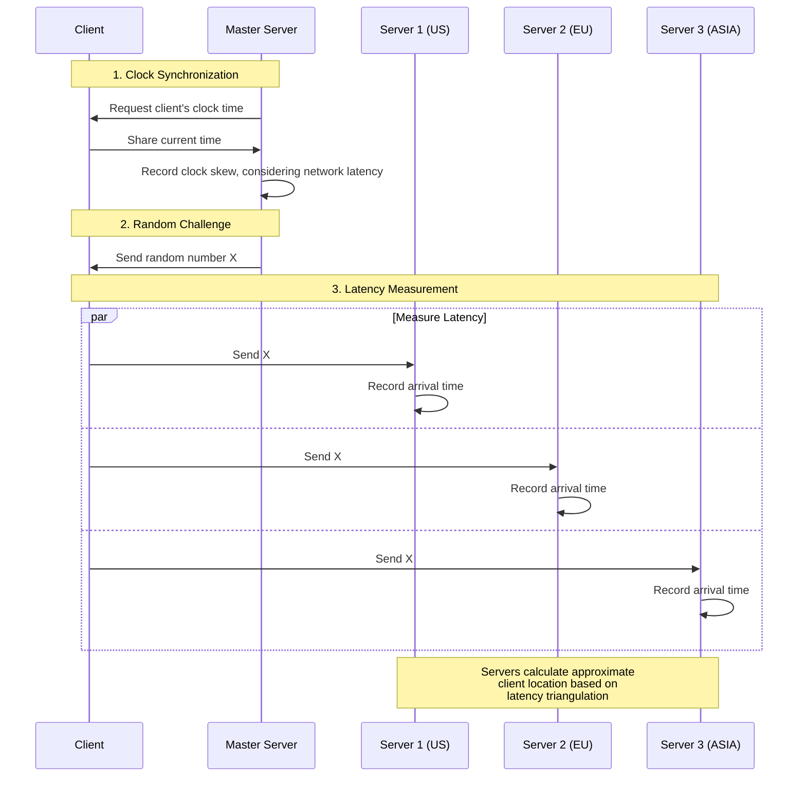

# ip-vote.com

For running polls where each IP address gets one vote.
For IPv6 votes, one vote per /64 block is allowed as the address space is much bigger and this block size would have a comparable purchase price of a IPv4 address.

The voting data is publicly shared with the last bit of the IP address masked.
This allows for independen analyses of the data.

Currently there is the option to exclude Tor exit node IP addresses to mitigate poll manipulation.
It is planned to also extend this to known VPN and Cloud IPs.

Live at:

https://ip-vote.com/a_or_b

## System design principles

The top priorities are decreasing operation cost while keeping options open for scalability.
Therefore we opted for a mimimalistic, serverless setup.
Instead of a database, we keep the state in cloud storage files. These are partitioned by IP addresses to mitigate potential issues arising from parallel updates to the same files during periods of high demand or DDoS scenarios. The parition sizes can be adapted if warranted.

## Geolocation

Users can chose to select their country.
The IP recorded addresses can be used as supportive evidence for validating the proclaimed geolocation.
In adddition there will be support for determining the rough geographic location based on network latency triangulation.
If users attempt to manipulate the latency measurements, they can only introduce delays. These delays would then surface large scale geolocation manipulation attemtps in the aggregated results data.

