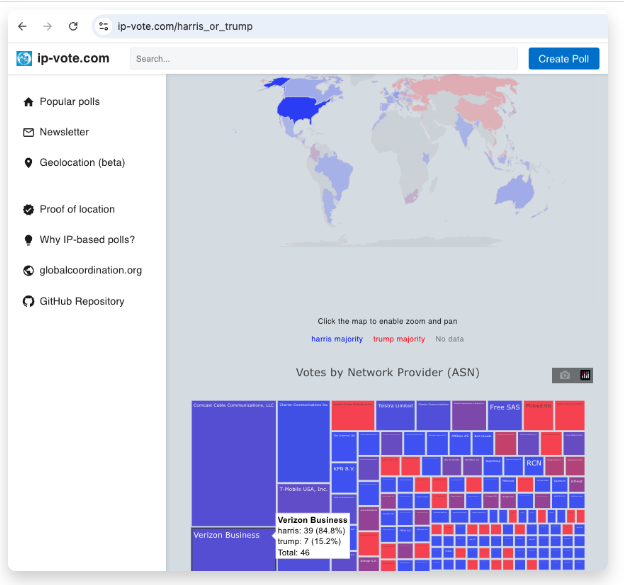

# ip-vote.com

  

For running polls where each IP address gets one vote per week.
For IPv6 votes, one vote per /64 block is allowed as the address space is much bigger and this block size would have a comparable purchase price of a IPv4 address.

The voting data is publicly shared with the last bit of the IP address masked.
This allows for independent analyses of the data.

Currently there is the option to exclude VPN, Tor exit node and cloud provider IP addresses to mitigate poll manipulation. In addition users have to fill out a CAPTCHA challenge to mitigate any fully automated manipulation.

Live at:

https://ip-vote.com/a_or_b

## System design principles

The top priorities are decreasing operation cost while keeping options open for scalability.
Therefore we opted for a mimimalistic, serverless setup.
Instead of a database, we keep the state in cloud storage files. These are partitioned by IP addresses to mitigate potential issues arising from parallel updates to the same files during periods of high demand or DDoS scenarios. The parition sizes can be adapted if warranted.

## Geolocation

In adddition to correlating IP's to location based on exsiting data sets, the rough geographic location is also determined from the network latency to different servers.
If users attempt to manipulate the latency measurements, they can only introduce delays. These delays would then surface large scale geolocation manipulation attemtps in the aggregated results data. Sending a random number (nonce) ensures that latencies can be measured without trusting the user's messages.
See <a href="https://ip-vote.com/geolocation_via_latency.html">Geolocation via latency</a> for further details.
